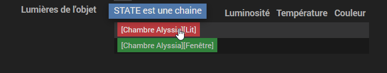
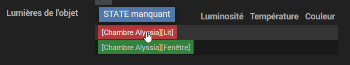
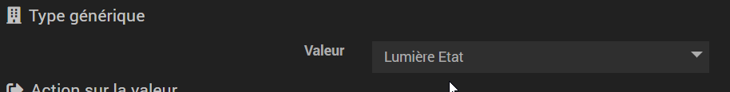

# Tutoriel HCL ![Work in progress]

Si tu es sur cette page c'est que tu rencontres quelques difficultés.

Voici un ensemble d'erreur pouvant facilement être corrigé.

## Sommaire
 - [STATE est une chaine](#state-est-une-chaine)
 - [STATE manquant](#state-manquant)
 - [FAQ](#faq)

## STATE est une chaine

Cela indique que la configuration du sous-type de votre commande état n'est pas correctement configurée. 
Dans la majorité des cas elle est configuré en _autre_ au lieu de _numérique_ ou _binaire_. Corriger la configuration du sous type et relancer le scan HCL.

## STATE manquant

Cela indique que la configuration _générique type_ est incorrect sur la commande _etat_ de votre lampe.
ex :

Corriger la configuration _générique type_  et relancer le scan HCL.

## FAQ
